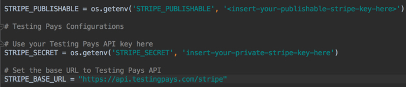

# Testing Pays

> Demonstrating how Testing Pays API can be used to test Stripe's payment processor.

## Requirements

Python 3.4.3 or later is required to run this application. You can have multiple Python versions (2.x and 3.x) installed on the same system without problems. See [Python Virtual Environments](http://docs.python-guide.org/en/latest/dev/virtualenvs/) for more information.

## Running

```
$ pip install -r requirements.txt

$ python manage.py runserver 8000 --settings=tp_python_stripe_example.settings.dev
```

See requirements.txt above for required packages or install using pip install as shown above. Prior to running the server it is necessary to add your Stripe publishable key and your [Testing Pays API key](https://admin.testingpays.com). 

## Updating API Keys



The [dev.py](tp_python_stripe_example/settings/dev.py) within the settings folder allows for testing settings to be kept separate from production settings. Update both the 'STRIPE_PUBLISHABLE' key that you got from Stripe and 'STRIPE_SECRET' key available from Testing Pays within the 'dev.py' file. 


In addition, update the 'STRIPE_PUBLISHABLE' key in the [donations.js](tp_python_stripe_example/python_stripe_payment/static/js/dontations.js)
file. 


The *quick* brown fox, jumped **over** the lazy [dog](https://en.wikipedia.org/wiki/Dog).

